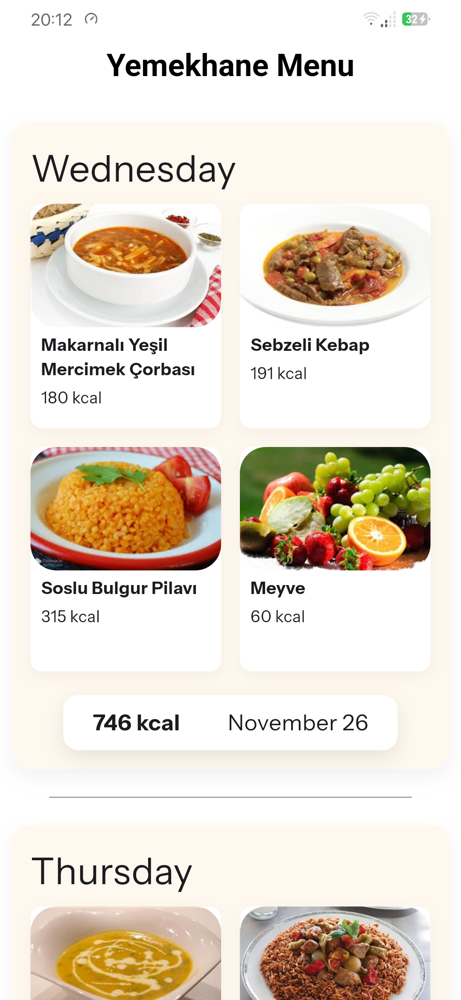
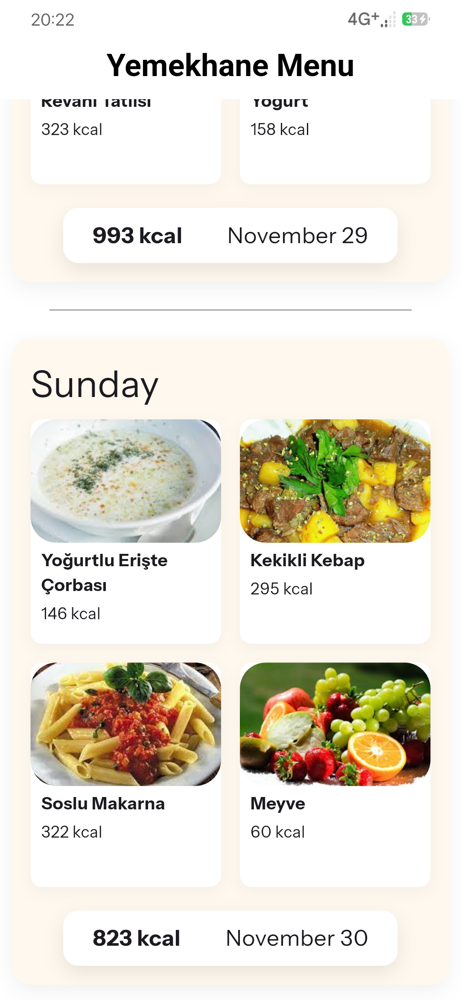

# Yemekhane Manas 🍛

**Yemekhane Manas** — a Flutter mobile application for students of Manas University and the Kyrgyz-Turkish University, allowing them to view the cafeteria menu for today and several days ahead.  

The app focuses on convenience and beautifully displaying information about dishes: photos, calories, and date of the menu.

---

## 📱 Features

- View menu for multiple days ahead.
- Beautiful cards for dishes with images, name, and calorie count.
- Total calories per day.
- Error handling for data and image loading.

---

## 🧩 Technologies

- [Flutter](https://flutter.dev/) (SDK 3.x)  
- [Dio](https://pub.dev/packages/dio) — HTTP client for REST API  
- [Provider](https://pub.dev/packages/provider) - State management
- [Hive_ce](https://pub.dev/packages/hive_ce_flutter) - Data caching
- [Talker](https://pub.dev/packages/talker_flutter) - Logging 

---

## 📸 Screenshots

  
    

---

## 📁 Project Structure

Project is using standard MVVM pattern. 

- 🧩models/ — Data models (MenuItem, DailyMenu).

- 👓view_models/ — Handles state management and business logic.

- 🔗services/ — API service using Dio and FormatDate service using intl.dart

- 👀screens/ — UI screens that consume the ViewModel.

---

🌐 API

- Using public API: [YemekManas](https://yemek-api.vercel.app/)

 ---

## 🔗 Dependencies

- [Provider](https://pub.dev/packages/provider)
- [Dio](https://pub.dev/packages/dio)
- [ImageCaching](https://pub.dev/packages/cached_network_image)
- [intl](https://pub.dev/packages/intl)
- [hive_ce](https://pub.dev/packages/hive_ce_flutter)
- [talker](https://pub.dev/packages/talker_flutter)

 ---

 ## 📜 License

  Apache 2.0 License  © [Atoktobekov](https://github.com/Atoktobekov)  
